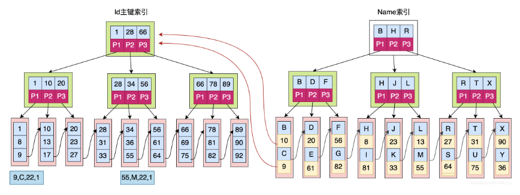
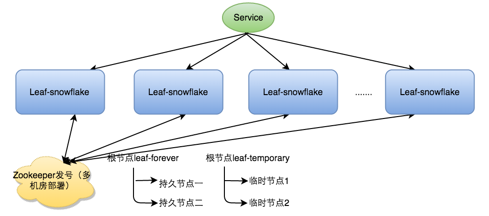

# JVM

## JMM

### 内存划分

在jdk1.8版本，将方法区移动到了元空间，元空间里存了类信息、字符串常量、静态变量


### 对象内存分配

连续内存用指针指向对象内存边界，或者用空闲列表来维护对象的内存位置。虚拟机如何分配内存主要还是看使用了什么垃圾收集器。对象大小必须是8字节的整数倍。

### 对象的内存布局

header、实例数据、对齐填充

header中有hashcode、gc年龄、锁状态、是否偏向锁、偏向线程id、偏向时间戳等

### 句柄和直接指针

句柄包含实例对象**地址**指针和class的地址指针；

直接指针是直接指向实例**对象**，并也有class的地址指针；

### 内存溢出

堆内存满了，无法申请新内存；

栈内存满了，递归无出口，无限申请引用；

元数据区（方法区）设置很小，频繁创建动态代理class；

直接内存溢出，使用unsafe直接分配内存，或者NIO使用内存较大，堆内存的dump文件是看不到直接内存的。

## GC

### 垃圾回收过程

**空间分配担保**：Minor GC 前会检查老年代连续可用空间是否大于新生代对象总和，如果小于则会看是否设置允许担保失败，如果允许则会计算老年代可用空间是否大于历次晋升老年代的平均值，大于则尝试MinorGC，否则就会Full GC。


### 可达性分析算法

GCRoot 到这个对象不可达时，可以被回收。GC Root有栈、native栈、元数据区（常量静态变量），jvm内部引用，class、异常、classload。

强、软、弱、虚引用：软，在GC计算内存足够则下次GC才回收；弱，发生GC就回收；虚引用获取不到对象，只用来接收gc回收的通知。

finalize() 调用后会进入F队列，优先级较低，但是还是会被GC回收，次方法只有一次调用有效。

### 跨代引用

在年轻代区域开辟一个空间做RememberSet，把老年代划分一个一个区域，记录哪些区域存在跨代引用，在MinorGC时，只有存在跨代引用的区域才会进行GC Root的扫描。

### 垃圾回收算法

标记清除：标记垃圾对象，并清除对象数据。缺点：随着对象数量增加，耗时增加；内存空间不连续，碎片化

标记复制：需要把内存划分两块相等大小的空间，只是用一半空间。存活对象多的时候，复制对象开销大

标记整理：在老年代把存活的对象像一端移动，清理掉边界外的内存。移动操作负担重需要STW。

### OopMap

在栈和寄存器中记录了一些普通对象指针的引用，GC root枚举就是从OopMap开始的。

### 安全区域

当用户线程sleep或者block的时候被标记安全，gc时会忽略这些线程。只有gc完成后，用户线程才会解除安全标记继续执行。

### RememberSet

在G1时代，Card Table 时实现RememberSet的一种方式，card table中的每个元素都标记一块内存区域，内存区域称作卡页，Hotspot中卡页为2的9次幂，card table中的0、1元素对应的地址范围：0x0000~0x01FF、0x0200~0x03FF

卡页中存在跨代指针，卡表中元素为1，标记为dirty数据，垃圾回收的时候优先把dirty的数据加入GC roots扫描

在引用赋值前或后，使用写屏障，来更新cardTable数据，G1是写前屏障。c++ 方法post_wirter_barrier

### 三色标记

用来处理并发可达性分析

白色：被收集器访问过，分析结束阶段，还是白色说明不可达

黑色：安全存活的，有引用指向黑色，黑色对象不可能指向白色对象，GCroot 是黑色的

灰色：被访问过，但是该对象还存在至少一个引用未被扫描到

在并发标记时，有引用变化，假设把黑色对象指向白色对象，黑色对象就需要再扫描一遍才能保留那个白色对象。

解决方案：增量标记或者原始快照（写屏障实现）。在并发扫描结束后通过这些关系再扫描有变化的地方。

### CMS

初始标记和重新标记需要STW。此处停顿时间短


缺点：并发过程中GC线程占用cpu资源，不超过25%，核心数小于4时，超过50%，降低吞吐量；

由于老年代使用标记清理算法，产生内存碎片，大对象无法分配时，提前触发Full GC整理内存空开，STW时间长

### G1 Garbage First

把堆划分成多个大小相等的Region，每个region都可以扮演Eden、survivor、老年代，region还有存大对象的区域humongous区域，超过region一半大。优先回收价值最大的区域。

G1的每个region都有自己的rememberSet，记录别的region指向自己的指针，并标记这些指针在哪些卡页范围内，所以复杂并且占用内存很大，G1需要使用堆得10-20%内存来维持收集器工作。

初始标记、最终标记、筛选回收都需要STW，筛选回收是根据region回收价值和成本来排序，根据用户期望回收时间来安排回收，把需要回收的region中存活对象复制到空region中（**这里必须STW**），再清理回收旧的region


### ZGC

也是region内存模型，但在指针上找出4位标记对象状态，没有了写屏障的开销


### GC调优

-XX: +PrintGC  或者+PrintGCDetail 或者+PrintHeapAtGC

SurvivorRatio =8:1 Eden区和survivor区比例

PretenureSizeThreshold 直接晋升老年代大小

MaxTenuringThreshold 晋升老年代年龄

-XX : G1HeapRegionSize g1的region大小 1-32Mb

-XX: +UseConc-MarkSweepGC  老年代使用cms

-XX : +UseParNewGC 新生代使用ParNew，标记复制

大内存硬件部署策略：核心是降低Full GC的频率 ，可以使用ZGC、Shenandoah垃圾收集器。推荐集群部署，深夜重启。

堆外内存溢出：堆外内存是依赖FullGC来回收垃圾，NIO后操作会增加直接内存的消耗。-XX: MaxDirectMemorySize增加内存

禁止System.gc()：设置参数-XX: DisableExplicitGC

- **jvm参数**

-Xmx 、-Xms 设置堆最大和最小内存


### 案例

1、接口调用频繁使用cglib动态代理导致meta_space内存溢出

-XX: +TraceClass-(un)loading 打印类加载卸载日志

-Xmeta_space 元数据区大小

设置单元测试，在开发环境设置较小元数据区，检查是否内存溢出。

2、大对象直接进老年代，防止在年轻的里频繁的minorGC，造成性能浪费。

 

## 类加载

过程：加载、验证、准备、解析、初始化、使用、卸载

类加载器：启动类加载器、扩展类加载器、应用程序类加载器

双亲委派：先看这个类是否已加载，加载了就直接返回；没加载，则看有没有Parent属性，有就调Parent的loadClass方法；没有parent就会从BootstrapClass中找一下，没找到就会调用当前ClassLoader的findclass方法加载类。

破坏双亲委派，重写loadClass方法，遵循原则重写findClass方法，例如UrlClassLoader。

自定义类加载器可以指定class文件来源，可以实现热加载。

## 栈帧

包含：局部变量表、操作数栈、动态链接、方法返回地址、其他信息

### 局部变量表

int[] a = new int[1024];

a=null;

int c=2;......

这里的a=null;//更新局部变量表的变量槽，是的在极短运行时GC能把a回收。

### 操作栈

**最大深度**在编译期决定了。操作栈中的每个元素必须与指令顺序严格匹配，iadd指令是必须是整型。

操作数栈之间可以共享数据，避免无用的复制。


### 动态链接

每个栈帧都包含一个执行常量池的当前方法的引用。常量池中的**符号引用**（在编译期并不知道类型的存储地址，用符号代替）会在第一次使用时转换成直接引用。

### 方法返回地址

传给方法调用者的值，一般是上层方法PC计数器值（恢复上层方法局部变量和操作数栈），异常时就只通过异常处理器来完成了。

### 多肽的实现

父子类在编译期有各自的虚方法表，子类实例在执行方法是用过方法索引掉自身的方法。


## 故障处理

### jdk8 bin目录下的命令

**jps**：像linux的ps命令，这个可用查看java 进程的pid，启动Main class。

8492 Jps
9932 Application

**jstat**  -gc：可以查看本地或者远端的虚拟机各内存区域的使用情况，以及GC次数。

 S0     S1     E      O      M     CCS    YGC     YGCT    FGC    FGCT     GCT
 0.00  99.94  36.91  15.75  94.27  91.44      5    0.053     1    0.043    0.096
 0.00  99.94  36.91  15.75  94.27  91.44      5    0.053     1    0.043    0.096

**jmap -dump**:file=a：堆的快照文件，可以查询finalize执行队列，堆、方法区详细信息、空间使用率、GC收集器信息。这个命令很占cpu资源，产线禁止。

**jmap -heap** 直接查看虚拟机中各个内存区域的使用情况

**jhat**：解析dump文件，查看堆中对象情况，查看内存泄漏

**jstack**：生成线程快照，查看所有线程的状态，以及运行的代码，通过有问题的pid去找对应线程代码。

**jConsole**：可视化工具，在线分析虚拟机堆，线程，对象情况。

### jdk9之后

**JHSDB**，独立的一个jvm进程提供可视化界面，实时分析其他虚拟机内部对象数据，也可以分析dump文件。


# 并发编程

## MESI协议

缓存一致性协议， MESI中每个缓存行都有四个状态，分别是M（modified）、E（exclusive）、S（shared）、I（invalid） 

这个状态是针对一个核心和cache line的状态，M：当前缓存已修改，未同步到主内存，dirty，需要写入主内存。

E：已写入主内存，此时没有其他核心访问。S：一旦有其他核心访问就变共享状态。I：其他CPU修改了就成无效状态


## 主内存

线程能否当前线程的工作内存和主内存的副本，也只能在这两块内存上读写数据。这里的主内存侧重的是物理硬件的内存，是内核态，内部的数据则对应着java堆中的实例对象。

内存间的交互


## volatile

1、保证线程可见，通过变量的读写的屏障来实现，直接从主内存中读写。（final也可以保证可见性，只要final修饰的属性，并且当前对象的this没有在构造器中暴露出去，final就是可见的）

2、禁止指令重排优化

## 线程

内核线程：直接由cpu调度执行，一般程序不直接使用

轻量级线程：每个轻量级线程都对应一个内核线程，需要从用户态到内核态切换

用户线程：轻量级线程也可以广义的认为是用户线程。用户线程的建立、同步、销毁不需内核的帮助。正常情况下都是需要内核的，只有在调度、阻塞的时候才有可能涉及内核的操作。

fiber 纤程：内部两个模块：执行过程（Continuation恢复上下文），调度器（Scheduler代码执行顺序）。**并发延迟更低**，吞吐量高，占用资源少。

### ThreadLocal

线程变量隔离


ThreadLocalMap底层存储结构


 hash冲突时：

ThreadlocalMap既没有链表，也没有红黑树，采用的是开放定址法 ，是这样，是如果发生冲突，ThreadlocalMap直接往后找**相邻**的下一个节点，如果相邻节点为空，直接存进去，如果不为空，继续往后找，直到找到空的，把元素放进去，或者元素个数超过数组长度阈值，进行扩容 

Entry中的key为什么用弱引用，利用垃圾回收机制，尽量避免内存泄漏。GC后key应用被回收，在调get方法时如果key为null则会在entry数组中清除这个entry。


## 多线程

协同式多线程：线程把自己的工作处理完了才会通知系统切换到另个系统上去，Lua语言就是如此，可支持脚本原子操作。

抢占式多线程：由系统分配执行时间和线程切换，java就是，Thread::yied()方法就是主动让出线程。

### 线程池

### 阻塞队列


## 锁

### Synchronized

升级优化

  

### 自旋锁

不阻塞线程，消耗cpu资源，模式自选10后没有获取到锁就挂起线程。

### 锁消除

即时编译器运行时，检查上锁的代码不可能有其他线程竞争就会消除锁。在方法里用Stringbuffer会转Stringbuider

### 锁粗化

一段代码反复枷锁释放锁，不然将锁范围扩大。

### 轻量级锁

对象头轻量级锁标记位置01时无锁

标记过程： 虚拟机将使用CAS操作尝试将对象的Mark Word更新为指向Lock Record的指针。如果更新成功，那么这个线程就获取了该对象的锁，并且将象Mark Word的锁标志位修改为00，有两个线程争锁就升级重量级锁10。

### 偏向锁

对象头锁标记为01（无锁）时可以尝试设置偏向锁，偏向某一个线程，无阻塞进入方法，在对象有上标记释放开启轻量级锁以及线程id


## 线程池

使用ThreadPoolExector，构造方法

```java
public ThreadPoolExecutor(int corePoolSize, //核心线程数据，最小可用线程数
                              int maximumPoolSize,//允许的最大线程数
                              long keepAliveTime,//超过核心线程数的线程不用的时候存活时间
                              TimeUnit unit,
                              BlockingQueue<Runnable> workQueue)//已达最大线程，进入阻塞队列
```

使用ScheduledThreadPoolExecutor可以构造延迟线程任务或者重复执行任务

```java
ScheduledFuture<?> scheduleAtFixedRate(Runnable command,
                                                  long initialDelay,
                                                  long period,//重复执行时间间隔
                                                  TimeUnit unit)//重复时间单位
```

拒绝策略（已最大线程且阻塞队列已满）：抛异常、调主线程、丢弃新的、丢弃最老的

# Spring

## IOC

将原本在程序中手动创建对象的控制权，交由Spring框架来管理，处理依赖关系、Bean的生命周期

springBean循环依赖

如果是单例、需要立即创建、允许循环依赖的情况下，是通过BeanDefinition中的depends依赖集合，看被依赖的Bean是否已经实例化，未实例化则报错。

## AOP

SpringAop有两种实现，JDK和Cglib都是运行时织入，AspectJ是支持编译时或者Class文件加载时织入


## WEB

**xss过滤**：自定义过滤器继承HttpServletRequestWrapper，**form表单**格式通过重写getParameterValues过滤，**json格式**重写getIntputStream()返回过滤后新建的ServletRequestStream。


## JDBC

主要使用类为JdbcTemplate，上层接口为**JdbcAccessor**（操作数据库连接）、**JdbcOperation**（exec、query、batchUpdate方法），**核心方法是JdbcTemplate的execute()**。其中数据库ConnectionHolder是从TransactionSynchronizationManager中ThreadLocal获取，DataSource作为key。

## ORM

Mybatis总体执行流程


  


## Actuator

 你可以通过实现`HealthIndicator`接口来自定义一个健康指标，或者继承`AbstractHealthIndicator`类 ，来暴露一个endpoint。

## 自动装配

类似java 的 SPI机制，在META-INFO中提供了服务类。

# 数据库

## 隔离级别

读未提交：A会话开启事务，update一行数据，没有提交，B会话能读到更新后的数据；(脏读)

读已提交：A会话先开启事务，读库存=5，此时B会话开启事务，把库存更新为4并提交，A会话再次读取时库存变成4；(幻读)

可重复读：A开启会话，读取库存库存，此时B开启事务，B不允许update，可以insert（此时A批量查询会有幻读）

序列化读：所有事务串行执行

## 

## Mysql

5.5版本之前是MyIsam存储引擎，之后是innoDB存储引擎。

innoDB支持，MyIsam不支持的：行级锁、事务、崩溃后恢复、外键、MVCC多版本并发控制（在读已提交、和可重复读隔离级别下有效，内部有乐观锁和悲观锁）

### 索引

**Mysql的innoDB是以主键为索引来组织数据的存储**，主键是聚集索引，索引和数据在一起存储

Mysql的innoDB使用的时B+Tree,深度为n时，每个节点存储n-1元素，节点超过n-1时就需要分裂，不足的会合并

主键索引能只需要查询一颗树，

扫库、扫表能力强，如果全表扫，直接从叶子节点的一端开始就可以了

磁盘读写能力强，叶子节点存了数据，根节点、直接点存的时向下的指针

排序、范围查找能力强，叶子结点有顺序指针相连

效率稳定，io次数就是树高度，每个节点查询io都一样



如上图，如果通过name进行数据检索：
**select * from users where name = ?**
需要需要在name索引中找到name对应的Id，然后通过获取的Id在主键索引中查到对应的行。整个过程需要扫描两次索引，一次name，一次id。

如果我们查询只想查询id的值，就可以改写SQL为：
**select id from users where name = ?**
因为只需要id的值，通过name查询的时候，扫描完name索引，我们就能够获得id的值了，所以就不需要再去扫面id索引，就会直接返回。

- 离散度公式：count(distinct(column_name)):count(*)，约接近1约好

## redis

5版本以及之前，都是单线程保证原子性，主要是内存读写，epoll多路复用处理请求事件。

### 底层实现

redis使用C写的！数据结构参考：https://blog.csdn.net/bskfnvjtlyzmv867/article/details/94237137?spm=1001.2014.3001.5501

所有key都存放在dict类型中，键值对都存放在dictEntry类型中。

- String，底层是SDS动态字符串结构，（不是char[]），字符串编码有三种，int，embstr（44长度内，并且只读，内容被修改了就会raw），raw

  String最大512MB，2的63次方-1。根据存的值大小会调整sds结构，空间预分配为2的5次方8、16、32、64次方。

  二进制安全：SDS不会依赖\0这个字符终止读，是依赖len已用长度终止读。

  SDS结构暴露的指针直接指向buf[]数组，可以快速访问。


redis可以用muti命令开启事务，可回滚，但不是强一致性的，用的最终一致性的方案。

### 命令

- bgsave命令 持久化redis数据
- info replication 查看当前主从状态
- 

### 持久化

RDB持久化：频率：时间活着key变化数量，例如10秒存了100个key，哪个先到就先触发。生成dump.rdb文件，保存了key、value、expire数据的内存快照

AOF持久化：实时记录redis的写操作log

RDB+AOF组合，RDB之后的时间内用AOF记录。

### 集群

redis.conf配置master ip  、从服务器只读，配置主从复制集群

sentinel.conf哨兵模式，哨兵在指定时间内发现master失联，就会发起选举，超过半数以上则选举成功。哨兵本身也是集群部署。

lettuce能支持哨兵部署，Jedis不行。

### key过期淘汰机制

官网地址：http://redis.cn/topics/lru-cache.html

定期删除：每个100ms随机删除，idle时间最长的key

惰性删除：在每次访问的时候看是否过期删除

内存回收策略：LRU（最少使用，idle时间最长）、TTL（优先收回存活时间短的）

### redis 事务

multi、exec、watch来实现多个命令打包一次性执行，不可回滚，所以redis事务可能不是原子性。

### 解决问题

缓存失效：对于热key，可以在value本身设置失效时间，每次读取都判断是否失效，延长过期时间；或者不设置失效时间

缓存穿透：无效key也存入缓存，设置有效期较短；使用布隆过滤器，多重hash算法确定一个key位置。

缓存雪崩：大面积缓存失效，master集群部署，缓存失效时间+范围随机值，设置二级缓存，二级缓存不过期


# 设计模式

## 设计原则

### 单一职责

- 类的复杂性降低，实现什么职责都有明确的定义
- 逻辑变得简单，类的可读性提高了，而且，因为逻辑简单，代码的可维护性也提高了
- 变更的风险降低，因为只会在单一的类中的修改

### 开闭原则

 业务逻辑的新增通过扩展来实现变化，而不是通过修改已有的代码实现变化 。

### 依赖倒置

抽象不依赖细节，细节依赖抽象。

上层接口不依赖下层实现的类，例如下单接口，上层有orderService，OrderRequest，OrderResponse接口，下单是否成功不需要依赖Wx、ZFB的具体实现DTO，DTO中都已经实现OrderReposne里的orderState方法。

### 迪米特原则

 只与直接的朋友通信 

# 网络通信

## tcp

### 消息头


   ●源、目标端口号字段：占16比特。TCP协议通过使用”端口”来标识源端和目标端的应用进程。端口号可以使用0到65535之间的任何数字。在收到服务请求时，操作系统动态地为客户端的应用程序分配端口号。在服务器端，每种服务在”众所周知的端口”（Well-Know Port）为用户提供服务。
　●顺序号字段：占32比特。用来标识从TCP源端向TCP目标端发送的数据字节流，它表示在这个报文段中的第一个数据字节，握手时从0开始，SYN标记占1个字节。
　●确认号字段：占32比特。只有ACK标志为1时，确认号字段才有效。当前已接收字节数。
　●头部长度字段：占4比特。给出头部占32比特的数目。没有任何选项字段的TCP头部长度为20字节；最多可以有60字节的TCP头部。
　●标志位字段（U、A、P、R、S、F）：占6比特。各比特的含义如下：
　◆URG：紧急指针（urgent pointer）有效。
　◆ACK：为1时，确认序号有效。
　◆PSH：为1时，接收方应该尽快将这个报文段交给应用层。
　◆RST：为1时，重建连接。
　◆SYN：为1时，同步程序，发起一个连接。
　◆FIN：为1时，发送端完成任务，释放一个连接。
　●窗口大小字段：占16比特。此字段用来进行流量控制。单位为字节数，这个值是本机期望下一次接收的字节数。
　●TCP校验和字段：占16比特。对整个TCP报文段，即TCP头部和TCP数据进行校验和计算，并由目标端进行验证。
　●紧急指针字段：占16比特。它是一个偏移量，和序号字段中的值相加表示紧急数据最后一个字节的序号。
　●选项字段：占32比特。可能包括”窗口扩大因子”、”时间戳”等选项。

### 传输可靠性

参考地址：https://blog.csdn.net/xuzhangze/article/details/80490362?utm_medium=distribute.pc_relevant.none-task-blog-2%7Edefault%7EBlogCommendFromMachineLearnPai2%7Edefault-2.vipsorttest&depth_1-utm_source=distribute.pc_relevant.none-task-blog-2%7Edefault%7EBlogCommendFromMachineLearnPai2%7Edefault-2.vipsorttest

1、 **确认应答（ACK）机制** 

2、 **超时重传机制** 

3、 **连接管理机制** 

4、 **流量控制** 

5、 **拥塞控制** 


### 三次握手


1、建立连接时，客户端发送SYN包（SYN=i）到服务器，并进入到SYN-SEND状态，等待服务器确认

2、服务器收到SYN包，必须确认客户的SYN（ack=i+1）,同时自己也发送一个SYN包（SYN=k）,即SYN+ACK包，此时服务器进入SYN-RECV状态

3、客户端收到服务器的SYN+ACK包，向服务器发送确认报ACK（ack=k+1）,此包发送完毕，客户端和服务器进入ESTABLISHED状态，完成三次握手，客户端与服务器开始传送数据。

**SYN攻击**

在三次握手过程中，Server发送SYN-ACK之后，收到Client的ACK之前的TCP连接称为半连接（half-open connect），此时Server处于SYN_RCVD状态，当收到ACK后，Server转入ESTABLISHED状态。SYN攻击就是Client在短时间内伪造大量不存在的IP地址，并向Server不断地发送SYN包，Server回复确认包，并等待Client的确认，由于源地址是不存在的，因此，Server需要不断重发直至超时，这些伪造的SYN包将产时间占用未连接队列，导致正常的SYN请求因为队列满而被丢弃，从而引起网络堵塞甚至系统瘫痪

### 四次挥手


这是因为服务端在LISTEN状态下，收到建立连接请求的SYN报文后，把ACK和SYN放在一个报文里发送给客户端。而关闭连接时，当收到对方的FIN报文时，仅仅表示对方不再发送数据了但是还能接收数据，己方也未必全部数据都发送给对方了，所以己方可以立即close，也可以发送一些数据给对方后，再发送FIN报文给对方来表示同意现在关闭连接，因此，己方ACK和FIN一般都会分开发送

### 沾包问题

TCP当中的粘包问题，UDP不存在粘包问题
首先粘包中的”包”指的是应用层的数据包，在TCP协议头中，没有像UDP一样的报文长度，只有一个序号一样的字段。从应用层的角度来看，应用层交付给传输层的数据都是一连串的字节数据，应用程序看到这一连串的字节数据，并不知道是从哪个部分到哪个部分是一个完整的应用数据包。而从传输层的角度来看，TCP是一个报文过来的，按序号排好序的放在缓冲区中。
如何避免粘包问题？
在应用层将包分开，明确两个包的边界
对于定常的包，保证每次都按固定大小读取即可；
对于变长的包，可以在报头的位置约定一个包总长度的字段，从而就知道了包的结束位置；
对于变长的包，还可以在包和包之间使用明确的分隔符（应用层协议是由程序员自己来确定的），如FTP协议\r\n

## http

http1.0是短链接，http1.1是长链接，需要client添加投connection：keep-alive，并且服务端也支持长链接。

三次握手：主要server端和client都要确认自己和对方发送、接收消息都是正常的。（1、syn1 2、ack1+syn2 3、ack2）

四次挥手：server在接收client关闭请求后，返现自己还有数据推送，就会在最后推送结束后，client确认结束后才会关闭链接。

https: 为加密传输，SSL/TLS协议建立在http之上


## NIO

 服务端和客户端各自维护一个管理通道的对象，我们称之为selector，该对象能检测一个或多个通道（channel）上的事件。我们以服务端为例，如果服务端的selector上注册了读事件，某时刻客户端给服务端送了一些数据，阻塞I/O这时会调用read()方法阻塞地读取数据，而NIO的服务端会在selector中添加一个读事件。服务端的处理线程会轮询地访问selector，如果访问selector时发现有感兴趣的事件到达，则处理这些事件，如果没有感兴趣的事件到达，则处理线程会一直阻塞直到感兴趣的事件到达为止 。

| 事件名                   | 对应值                     |
| ------------------------ | -------------------------- |
| 服务端接收客户端连接事件 | SelectionKey.OP_ACCEPT(16) |
| 客户端连接服务端事件     | SelectionKey.OP_CONNECT(8) |
| 读事件                   | SelectionKey.OP_READ(1)    |
| 写事件                   | SelectionKey.OP_WRITE(4)   |

 选择器用于使用单个线程处理多个通道 ：


## websocket

建立在tcp之上，有握手规则，长连接。ws协议，wss加密协议。

springboot实现只要靠注解@ServerEndPoint @OnMessage（这里的session不是severlet的session，所以id不同）

## 网络安全


# 消息中间件

## rabbitmq

官网：https://www.rabbitmq.com/

- virtualHost 类似redis对的db
- 信道
- 交换机
- 队列

### AMQP协议

 AMQP是一个二进制协议。有不同类型的帧`frame` 构成。帧会携带协议的方法以及其他信息。所有的帧都有相同的基本结构，即：帧头，payload，帧尾。payload格式取决于帧的类型 

三个主要主键：

- `exchange`（交换器）：从Publisher程序中收取消息，并把这些消息根据一些规则路由到消息队列（Message Queue）中
- `message queue`（消息队列）：存储消息。直到消息被安全的投递给了消费者。
- `binding` ：定义了 `message queue` 和 `exchange` 之间的关系，提供了消息路由的规则


### 普通模式：

使用默认交换机

简单队列 1对1，消费慢时会堵塞队列

工作队列 1对多，消费者轮询

公平模式，能者多劳，设置消费者一次消费几条消息，只有消费完了才能接收消息

### 发布-订阅模式

1对多，消费者都能接收消息，通过交换机（fanout模式）实现，交换机绑定队列。交换机根据消费者生成队列，并且是排他队列，其他链接不可见。


发布-订阅-routing模式

改直连模式，通过路由key决定发到哪个队列


### 主题模式topic


### RPC模式

### 事务

消息发送者，不知道消息有没有发送到队列；会降低性能。二阶段提交，broker接收消息成功，发送者commit后队列中才有消息。

#### 确认模式

信道channel开启确认模式后，产生唯一id。发送者在发送消息等mq回复确认的时候可以同时发其他消息。根据id状态判断是否确认。

有同步异步确认方式。

springboot整合，添加spring-boot-starter-amqp就可以了，创建队列、交换机、绑定路由规则。


## kafka

基于日志收集的消息，性能高，但是会漏发消息。

kafka真正保存消息的地方在partition中，一个topic对应多个partition（可以理解为队列），所以kafka只能保证partition中消息有序消费。

### 模块

broker：表示kafka服务器

分区：针对主题进行负载均衡处理，一个主题多个分区，每个分区在不同的broker上。

副本：指每个分区的容灾备份数据，副本和Leader分区不在一个Broker上


### 消息存储和读取

在Broker服务器上有log目录，每个topic-0（主题-分区）都有对应目录存储消息，0000.index，0000.log

index文件是消息消费的offset->对应log表中具体消息数据的起始偏移量。例如1-7765，消息索引为1，文件中偏移量为7765。

生产者可以指定发送消息到哪个分区，或者可以根据设置key的hash值指定分区


### 如何保证消息不丢失

设置acks=all（-1）：表示所有副本都同步消息后，才认为消息发送成功，延迟略高，有可能数据会重复。

**ISR**：in-sync replica set 保存了leader和follower同步的集合，follower宕机会被踢出，leader宕机会从isr中选举leader。

 

设置replication.factor >=3  设置分区副本至少3个。

设置min.insync.replicas>1 表示消息至少2个副本才算写入成功，这个值要比上面的设置分区副本要小。

### exactly once

0.11版本之后，在At Least Once的基础上（acks=-1）添加了幂等性，消息去重。生产者和broker建立链接后，在相同会话内会给消息附上一个唯一的pid，根据pid对消息去重。

### 数据一致性

一个分区中leader和follower的最大offset叫leo，保证了生产数据一致性。最小offset是HW，是消费可见最高位置，保证了消费一致性。

### 消费方式

push模式，broker推送，消费速度局限于broker的推送速度。

pull模式，消费速度由消费者自己控制，无消息时通过timeout定时通信。

Topic的分区分配策略：默认range，分区平均分个消费者，消费者数量变化时重新分配。

### Offset维护

消费者组对于某一个分区的消费的offset是唯一的，消费者不指定消费者组时，默认自己成为一个组。

# 分布式

## 分布式系统一致性

- **水平拆分**指由于单一节点无法满足性能需求，需要扩展为多个节点，多个节点具有一致
  的功能，组成一个服务池， 一个节点服务一部分的请求量，所有节点共同处理大规模
  高井发的请求量。
- **垂直拆分**指按照功能进行拆分，秉着“专业的人干专业的事”的原则，把一个复杂的功
  能拆分为多个单一、简单的功能，不同的单一功能组合在一起，和未拆分前完成的功
  能是一样的。由于每个功能职责单一、简单，使得维护和变更都变得更简单、容易、
  安全，所以更易于产品版本的选代，还能够快速地进行敏捷发布和上线。

- 

### CAP理论

- C(一致性) 各个节点数据必须统一保持一致；
- A(可用性) 保证服务的高可用 必须返回响应结果
- P(分区容错) 网络分区可能会造成脑裂问题，部分server与集群其他节点失去联系 无法组成一个群体；
  不能三者兼顾 只能实现取舍 CP、AP、CA

### BASE理论

### 1、基本可用

基本可用是指分布式系统在出现不可预知故障的时候，允许损失部分可用性----注意，这绝不等价于系统不可用。比如：

（1）响应时间上的损失。正常情况下，一个在线搜索引擎需要在0.5秒之内返回给用户相应的查询结果，但由于出现故障，查询结果的响应时间增加了1~2秒

（2）系统功能上的损失：正常情况下，在一个电子商务网站上进行购物的时候，消费者几乎能够顺利完成每一笔订单，但是在一些节日大促购物高峰的时候，由于消费者的购物行为激增，为了保护购物系统的稳定性，部分消费者可能会被引导到一个降级页面

### 2、软状态

软状态指允许系统中的数据存在中间状态，并认为该中间状态的存在不会影响系统的整体可用性，即允许系统在不同节点的数据副本之间进行数据同步的过程存在延时

### 3、最终一致性

最终一致性强调的是所有的数据副本，在经过一段时间的同步之后，最终都能够达到一个一致的状态。因此，最终一致性的本质是需要系统保证最终数据能够达到一致，而不需要实时保证系统数据的强一致性

### 4、相关应用

- Zookeeper如果有过半数服务宕机了，可能存在无法使用，但保证了一致性`(保证CP)`；二阶段提交，master写数据，slaver返回超过一半时，提交。
- Eureka如果有服务宕机了，保证其他服务可用即可，保证了可用性(保证AP)， Eureka采用去中心化思想，如果使用Eureka实现集群，它的每个节点都是相等的；没有主从概念 ，采用相互注册原理 ，如果客户端访问的Eureka宕机之后会自动切换其他Eureka节点；只要能够有一台Eureka服务正常使用，整个服务注册中心就使用 
-  Nacos从1.0版本支持`CP`和`AP`混合模式集群，默认是采用`Ap`保证服务可用性; `CP`的形式底层集群采用`raft`协议保证数据的一致性的问题，一次性提交，达到半数以上返回提交成功，选举`Leader`角色 


## 分布式锁

 1、Redis获取分布式锁主要是靠 `setnx` 命令来实现的，该命令表示当 key 存在时，set 失败，返回为0，key 不存在 set 成功返回 1。 Redis集群使用Redisson框架。

2、 ZooKeeper实现分布式锁主要依靠ZK上创建临时唯一节点实现，多个进程竞争在ZK上创建一个临时节点，ZK保证只有一个节点创建成功，创建成功的进程相当于成功获取锁，其他未获取锁的进程则监听该临时节点的删除事件（`Watcher`），重新获取锁。 可以使用curator框架。


## 分布式事务

### ACID概念

- 原子性（Atomicity），可以理解为一个事务内的所有操作要么都执行，要么都不执行。
- 一致性（Consistency），可以理解为数据是满足完整性约束的，也就是不会存在中间状态的数据，比如你账上有400，我账上有100，你给我打200块，此时你账上的钱应该是200，我账上的钱应该是300，不会存在我账上钱加了，你账上钱没扣的**中间状态**。
- 隔离性（Isolation），指的是多个事务并发执行的时候不会互相干扰，即一个事务内部的数据对于其他事务来说是隔离的。
- 持久性（Durability），指的是一个事务完成了之后数据就被永远保存下来，之后的其他操作或故障都不会对事务的结果产生影响。

### 2PC

 2PC（Two-phase commit protocol），中文叫二阶段提交。 **二阶段提交是一种强一致性设计**，2PC 引入一个事务协调者的角色来协调管理各参与者（也可称之为各本地资源）的提交和回滚，二阶段分别指的是准备（投票）和提交两个阶段。 


框架：atomikos，基于JTA协议实现,都execute预提交成功后才真正commit

### 3PC

3PC 的出现是为了解决 2PC 的一些问题，相比于 2PC 它在**参与者中也引入了超时机制**，并且**新增了一个阶段**使得参与者可以利用这一个阶段统一各自的状态。

3PC 包含了三个阶段，分别是**准备阶段、预提交阶段和提交阶段**，对应的英文就是：`CanCommit、PreCommit 和 DoCommit`。


### TCC

基于二阶段提交的优化，先try执行业务逻辑预提交（try失败了那就需要把那些try成功的cancel），confirm或者cancel（这两个阶段如果失败是需要重试的）

参考地址https://blog.csdn.net/liuhuiteng/article/details/96287233?ops_request_misc=%257B%2522request%255Fid%2522%253A%2522161992806516780255240786%2522%252C%2522scm%2522%253A%252220140713.130102334..%2522%257D&request_id=161992806516780255240786&biz_id=0&utm_medium=distribute.pc_search_result.none-task-blog-2~blog~sobaiduend~default-1-96287233.pc_v2_rank_blog_default&utm_term=%E5%88%86%E5%B8%83%E5%BC%8Ftcc

### 实现方案

#### ***本地消息表***

我们首先需要在本地数据新建一张本地消息表，然后我们必须还要一个MQ（不一定是mq，但必须是类似的中间件）。

　　消息表怎么创建呢？这个表应该包括这些字段： id, biz_id, biz_type, msg, msg_result, msg_desc,atime,try_count。分别表示uuid，业务id，业务类型，消息内容，消息结果（成功或失败），消息描述，创建时间，重试次数， 其中biz_id，msg_desc字段是可选的。

　　实现思路为：

- A 系统在自己本地一个事务里操作同时，插入一条数据到消息表；
- 接着 A 系统将这个消息发送到 MQ 中去；
- B 系统接收到消息之后，在一个事务里，往自己本地消息表里插入一条数据，同时执行其他的业务操作，如果这个消息已经被处理过了，那么此时这个事务会回滚，这样**保证不会重复处理消息**；
- B 系统执行成功之后，就会更新自己本地消息表的状态以及 A 系统消息表的状态；
- 如果 B 系统处理失败了，那么就不会更新消息表状态，那么此时 A 系统会定时扫描自己的消息表，如果有未处理的消息，会再次发送到 MQ 中去，让 B 再次处理；
- 这个方案保证了最终一致性，哪怕 B 事务失败了，但是 A 会不断重发消息，直到 B 那边成功为止。

　　这个方案**严重依赖于数据库的消息表来管理事务，这样在高并发的情况下难以扩展，同时要在数据库中额外添加一个与实际业务无关的消息表来实现分布式事务，繁琐。**

#### OutBox+CDC实现分布式事务

本地业务数据与outBox表写入放在一个事务里，通过kafka的读写数据库outBox的执行日志，cdc模式，来转成消息供消费方消费。


## 分布式任务

## 分布式会话

## 分布式ID

### Leaf方案

Leaf Segment 数据库方案：提前在proxy sever 中获取号段，等用完后再去数据获取step++的号段

有点：性能好，leaf有缓存即使db宕机也能用，ID可自增

缺点：id不够随机，有波动，大量在号段用完时DB I/O耗时 

（双buffer方案，两个segment，当一个只剩10%号段时，检查另一个segment是否有号段，无则启动线程补充另一个segment）

  


leaf snowflake

1. 启动Leaf-snowflake服务，连接Zookeeper，在leaf_forever父节点下检查自己是否已经注册过（是否有该顺序子节点）。

2. 如果有注册过直接取回自己的workerID（zk顺序节点生成的int类型ID号），启动服务。

3. 如果没有注册过，就在该父节点下面创建一个持久顺序节点，创建成功后取回顺序号当做自己的workerID号，启动服务。

     

 解决时钟问题

 


## 分布式幂等

## 分布式文件系统

FastDFS

# 微服务

## 微服务拆分

### 原则

1、针对某服务纵向拆分最多分三层，两次调用（接口层 -> 综合服务层（复杂业务逻辑）->基础服务层（数据库缓存））

2、单向调用、禁止循环调用

3、同步接口、异步化，用消息中间件实现服务间的解耦

4、接口幂等性，用分布式id记录业务状态（有限状态机），分布式锁实或者CAS实现

5、接口数据结构不能透传（从外层到底层都是一个数据结构）、内嵌（上层接口内嵌底层接口数据结构），字段修改影响涉及太广


## ESB 

企业服务总线，是SOA服务化的一种实现，本身不属于微服务，是它的前身，ESB本身是一个过重的整体服务，系统变更影响范围太广

ESB 也适用于事件处理、数据转换和映射、消息和事件异步队列顺序处理、安全和异常处
理、协议转换和保证通信服务的质量等场景。

## Eureka

注册中心 无Master概念，eureka实例相互注册，相互同步。可以配置SpringSecurity设置用户密码。

## Consul

raft算法、内置分布式一致协议、key-value格式配置中心，go语言编写，仅仅一个可执行文件。

有server和client的概念，都是Consul的实例，如图，微服务和client对接，并且部署在同一台机器上，1对1。

client join到Server，Server集群也是挑一台join到Server，最后用raft算法选举Master。

微服务纯消费方，不需要注册到注册中心（client）。


## Nacos

注册中心可选内存实例和持久化实例，一般都是内存实例

微服务的AP，CP策略，在服务注册时选择

```java
private ConsistencyService mapConsistencyService(String key) {
        return KeyBuilder.matchEphemeralKey(key) ? ephemeralConsistencyService : 		         persistentConsistencyService;
}
```

AP模式使用DistroConsistencyServiceImpl，Distro协议


### 服务注册

微服务启动时生成ServiceInstanc信息，和BeatInfo信息，内部使用ScheduledThreadPool，反复调用，发送信息到注册中心

注册微服务实例

```java
public void put(String key, Record value) throws NacosException {    
    onPut(key, value);    //先copyOnWrite写到本地服务列表
    //再分发到其他集群，批量同步，达到1000个实例就同步
    distroProtocol.sync(new DistroKey(key, KeyBuilder.INSTANCE_LIST_KEY_PREFIX), DataOperation.CHANGE,            globalConfig.getTaskDispatchPeriod() / 2);
}
```

### 健康检查

注册中心会启动定时任务开启健康检查，15秒查询一次微服务实例，把实例健康属性设置下


## Hystrix

### 隔离

线程池隔离:（适合耗时长的接口）

- 可支持超时，直接返回
- 支持同步异步
- 消耗大，线程上下文切换
- 无法传递HTTP Header

和信号量隔离：（适合耗时极短的接口）

- 消耗小，用Semaphare实现
- 请求线程和provider的线程相同，可以传递HTTP Header
- 不支持超时设置
- 不支持异步


### 降级

超时降级、资源不足时(线程或信号量)降级，降级后可以配合降级接口返回托底数据。FallbackFactory可以生成一个service的匿名内部类，并可读取异常信息。

### 融断

当失败率达到阀值自动触发降级(如因网络故障/超时造成的失败率高)，熔断器触发的快速失败会进行快速恢复。

1、触发条件：设置10秒内请求数达到几次 2、熔断条件：失败率达到多少 3、接口重试时间

### 请求合并

提供了请求缓存、请求合并实现，被合并的接口需要用Future改成异步的。支持实时监控、报警、控制（修改配置）

设置合并请求数和合并等待时间。


## 网关

具有统一接入、流量管控、安全防护、协议适配的四大功能

### Nginx

location 设置代理，proxy_pass就是路由去向的路径


upstream设置代理集群


### zuul

zuul的四个周期，pre，routing，error，post，可以通过继承ZuulFilter来实现各个生命周期的过滤

自带依赖Hystrix，可以实现接口监控。

FallbackProvider处理连接超时异常的熔断，可以指定微服务来处理

可以配置限流，基于接口维度的限流，也可以自定义限流，根据参数来限流，通过集成RatelimitKeyGenerater来配置限流策略，可以通过redis保存key并设置请求次数和超时时间。

### Gateway

路由断言支持：path、时间、RequestMethod、param、Header作为条件

动态路由：通过注册中心实现负载均衡

过滤器：Header、paremeter、path、status、session、retry、redirect、RateLimiter、Hystrix

RateLimiter是使用redis+lua脚本实现的

计数算法实现：

 req_ratelimit.lua 

```lua
local key = "req.rate.limit:" .. KEYS[1]   --限流KEY
local limitCount = tonumber(ARGV[1])       --限流大小
local limitTime = tonumber(ARGV[2])        --限流时间
local current = tonumber(redis.call('get', key) or "0")
if current + 1 > limitCount then --如果超出限流大小
    return 0
else  --请求数+1，并设置1秒过期
    redis.call("INCRBY", key,"1")
    redis.call("expire", key,limitTime)
    return current + 1
end
```

- 我们通过KEYS[1] 获取传入的key参数
- 通过ARGV[1]获取传入的limit参数
- redis.call方法，从缓存中get和key相关的值，如果为nil那么就返回0
- 接着判断缓存中记录的数值是否会大于限制大小，如果超出表示该被限流，返回0
- 如果未超过，那么该key的缓存值+1，并设置过期时间为1秒钟以后，并返回缓存值+1


## Robbin

自带负载策略：轮询、随机、权重轮询（根据服务响应时间调整权重）、最小并发、可用敏感性（过滤高并发的）、区域敏感（排除不稳定网段ip)

点对点模式：可以在配置文件中指定某个微服务的ListofServer ip，适用开发环境，不通过注册中心获取ip。


 如果发现连接失败，则会自动切换至其他的节点，只要有一台还在，就能保证注册服务可用（保证可用性），只不过查到的信息可能不是最新的（不保证一致性）

## OpenFeign

设置fallbackFactory可以通过实现FallbackFactory的create方法捕获异常。

### feign性能优化

- Gzip压缩，客户端请求需带Accept-Encoding:gzip,deflate表示支持gzip压缩
- http连接池，使用httpclient连接池，添加feign-httpclient依赖
- 状态查看，可以用logback或者用sleuth
- 请求超时，默认1秒超时，需要延长时间


## 链路追踪

### SpringCloud Sleuth

链路追踪、性能分析、可视化错误

概念：span，每一次的rpc调用就是一次span，下游span会记录parent为上游span；

​		  trace，traceid，记录了一次由客户端发起的完整调用，调用链上的span的traceid一样。

### Zipkin

基于Google Dapper论文设计，聚合各个异构系统监控数据，提供可视化界面，可插拔数据存储方式，支持内存，mysql，elasticsearch


### ELK分析追踪数据


## SpringCloud Stream


使用交换机概念，可以发送消息并接收交换后的消息。 

通过消息分组，解决消息被集群重复消费，设置分组后交换机只对应一个queue。

消息分区，可以让单台消费者消费消息，谁先抢到第一个后续消费所有的消息。

## SpringCloud Bus

SpringCloudConfig配置中心就是基于SprigCloud Bus实现的。所有微服务都监听同一个Bus主题。使用actuator暴露bus-refresh端点，进行git的webhook调用，也可以更新某一个微服务实例活着集群的配置，实现灰度。


## Sentinel

通过注解@SentinelResource定义资源，在项目启动后第一次接口调用后会识别依赖关系，提供可视化配置页面，可以设置限流或者熔断的配置。

# 负载均衡

## nginx

## 负载均衡算法

# 搜索中间件

ElasticSearch

solr

lucene

存储中间件

FastDFS

HDFS


# 高可用

## 限流

### 1、计数器

通过原子变量计算单位时间内的访问次数，如果超出某个阈值（QPS），则拒绝后续的请求， 等到
下一个单位时间再重新计数。


正常进入当前时间槽位都是0开始的，计数时需要看下一槽位是否为0，不为零需要清零，记录清零时间。

当前时间进入槽位时，开始不为零，则判断清零时间是否为上一秒或当前时间，不是则清零记录清零时间。

简单代码实现：

```java
private static boolean countLimit() {
        long currentSeconds = DateUtil.currentSeconds();
        int index = (int) (currentSeconds % 10);
        if (slots[index] < qps) {
            slots[index]++;
            slots[(index + 1) % 10] = 0;
            return true;
        } else {
            return false;
        }
    }
```

缺点：

临界问题，导致流量变2倍，并且会多出时间窗口无流量请求。


### 2、漏桶

出水桶恒定的速率，超出桶流量则扔掉

缺点：突发请求较高时，网关压力大，服务资源没有充分利用


### 3、令牌桶

可以用ConcurrentLinkedDeque存放令牌，可提前存放一定数量的令牌，设置一个维护线程按一定速率往里添加token。

### 4、Semaphare

信号量，利用jvm AQS阻塞超出信号量预设值的请求。


## 秒杀

使用redis在list中提前设置秒杀数量，每个请求进来pop一个数据；后台服务开启事务消费这个数据，如果消费失败活着超时，重新放回redis；最终的消费成功看数据库事务结果活着乐观锁控制。


## ETCD

# Netty

## 线程模型

boss Group 单线程 负责处理客户端连接fd转成channel注册到EventLoop，worker group多线程，负责有事件响应的channel


# Linux

## 系统

### 系统调用

大部分应用程序都是用户态，在以下功能下会调用系统内核：文件管理、进程管理（阻塞唤醒）、内存管理、设备管理（设备开关）、进程通信

线程退出：80退出为用户线程退出（当内核线程需要IO时，对用户线程进软中断）

IO相关**系统调用**方法accept（bio）、select（nio）、bind、socket，查看这些方法说明的命令：**man** accept、查看系统2级别方法man 2 bind。

linux开启一个IO，先socke获取fd，bind，listen。


## epoll

fd：数字，文件描述符（类似java中的引用）

epoll的三个方法，epoll_create 返回一个文件描述符（指向内核记录io的内存区域epfd），epoll_ctl 注册到epfd内存区域中（将(添加修改删除)fd相关事件，添加回epfd），epoll_waite 等待事件(可以选择阻塞【timeout=-1】和非阻塞，在io的文件描述符指定是否阻塞，Nginx阻塞，redis不阻塞，设置100毫秒超时时间【redis6之前都是单线程，除了监听端口还要做其他事RDB、AOF等】)

内核的select（）直接获取可读可写的io文件描述符（类似io的引用）O（1）的时间复杂度。通过网卡等内核的事件驱动，将可读可写accept等事件的fd放入select方法指向的内存区域中。


## 零拷贝

mmap 用户空间开辟一块内存，能不需要拷贝到kernel空间（内核的write方法），直接写入磁盘。

kafka的消息写入磁盘时零拷贝。

kafka消费者读取消息时，用了内核的sendfile（）方法，指定了输入、输出的文件描述符，不需要再将文件读到用户空间。


## 操作命令

./ 代表当前目录下  /代表根目录下

/proc/进程号 查看进程内容，fd目录下查看io 描述符

netstat -natp 查看系统网络连接状态

vim 编辑文件，i进入编辑模式 :wq退出并保存 :q只退出

tail -f 自动刷新查看文件内容，可以用来看日志，tail -100f 最后100行日志

touch 新建空文件

## 进程通信

1、管道pipe：管道是一种半双工的通信方式，数据只能单向流动，而且只能在具有亲缘关系的进程间使用。进程的亲缘关系通常是指父子进程关系。
2、命名管道FIFO：有名管道也是半双工的通信方式，但是它允许无亲缘关系进程间的通信。
3、消息队列MessageQueue：消息队列是由消息的链表，存放在内核中并由消息队列标识符标识。消息队列克服了信号传递信息少、管道只能承载无格式字节流以及缓冲区大小受限等缺点。
4、共享存储SharedMemory：共享内存就是映射一段能被其他进程所访问的内存，这段共享内存由一个进程创建，但多个进程都可以访问。共享内存是最快的 IPC 方式，它是针对其他进程间通信方式运行效率低而专门设计的。它往往与其他通信机制，如信号量，配合使用，来实现进程间的同步和通信。
5、信号量Semaphore：信号量是一个计数器，可以用来控制多个进程对共享资源的访问。它常作为一种锁机制，防止某进程正在访问共享资源时，其他进程也访问该资源。因此，主要作为进程间以及同一进程内不同线程之间的同步手段。
6、套接字Socket：套解口也是一种进程间通信机制，与其他通信机制不同的是，它可用于不同及其间的进程通信。
7、信号 ( sinal ) ： 信号是一种比较复杂的通信方式，用于通知接收进程某个事件已经发生。
————————————————
原文链接：https://blog.csdn.net/zhaohong_bo/article/details/89552188